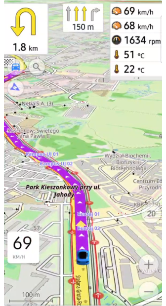
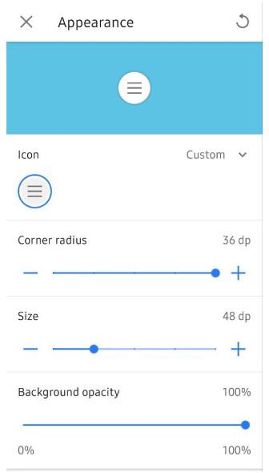
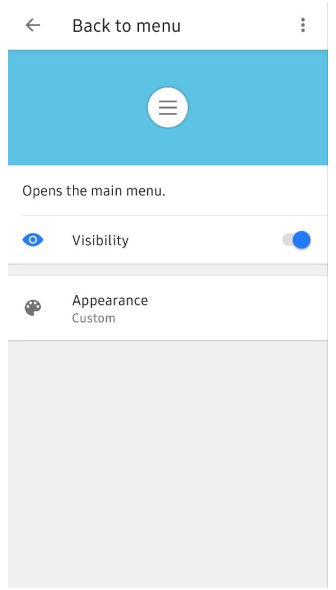

import Tabs from '@theme/Tabs';
import TabItem from '@theme/TabItem';
import AndroidStore from '@site/src/components/buttons/AndroidStore.mdx';
import AppleStore from '@site/src/components/buttons/AppleStore.mdx';
import LinksTelegram from '@site/src/components/_linksTelegram.mdx';
import LinksSocial from '@site/src/components/_linksSocialNetworks.mdx';
import Translate from '@site/src/components/Translate.js';
import InfoIncompleteArticle from '@site/src/components/_infoIncompleteArticle.mdx';
import ProFeature from '@site/src/components/buttons/ProFeature.mdx';
import InfoAndroidOnly from '@site/src/components/_infoAndroidOnly.mdx';  

# Android 4.9 (beta)

Android 4.8 is the latest release that introduces many new features and improvements to the OsmAnd app. This article describes all the key updates that represent meaningful changes for our users.

# Join Beta

OsmAnd releases several Ready-To-Use builds daily, allowing you to track new features and participate in the OsmAnd translation process. You can take part in testing the beta version of OsmAnd using Google Play.

  <a class="button button--active" href="https://play.google.com/apps/testing/net.osmand.plus">OsmAnd+</a>
  <a class="button button--active" href="https://play.google.com/apps/testing/net.osmand">OsmAnd</a>

  

 

# What's new

- Added a full-screen [gallery viewer](#images-gallery) for Wikimedia images,
- Introduced a new [plugin "Vehicle Metrics"](#vehicle-metrics) to monitor vehicle performance using the OBD-II protocol,
- Added the ability to assign [activities to tracks and filter](#gpx-track-activities) them accordingly,
- Introduced customizable map [button appearance and a precise grid](#customizable-map-buttons),
- [Context menu for widgets](#widget-context-menu),
- Implemented new quick actions for trip recording and [touchscreen lock](https://github.com/osmandapp/OsmAnd/issues/20742),
- Added quick action to [control visibility of OSM Edits](https://github.com/osmandapp/OsmAnd/issues/20711),
- Added a context menu and a "Reset average speed" action to widgets,
- Added new route layer ["Dirt Bike trails"](https://github.com/osmandapp/OsmAnd/issues/18756),
- Added information about surrounding areas for the selected point,
- Separated visibility parameters for Terrain colorization options,
- Added a tappable icon to display access or other road or path attributes,
- Fixed "Auto-record track during navigation",
- Fixed issue with fliped coordinates in RTL,
- Fixed missed sensor data for currently recording track,
- [4.8 issue Key “D”, “N”, “S” doesn't work on external Keyboards is fixed](https://github.com/osmandapp/OsmAnd/issues/20636),

<!-- 
- [Activities](https://github.com/osmandapp/OsmAnd/issues/17997) for GPX track data.
- [Autosync](https://github.com/osmandapp/OsmAnd/issues/18212) OsmAnd Cloud.
- [Smartwatch](https://github.com/osmandapp/OsmAnd/issues/9258).
- Created quick actions to represent 'Map rotate'
- Default buttons – Appearance.
- Main navigation widgets.
- Search (USA address).
- Nautical maps (new data).
- Traffic (Germany and Netherlands).
- Geographic grid.
-->

## Images Gallery

Added on [Map Contex menu](../user/map/map-context-menu.md#online-photos) full-screen gallery viewer for Wikimedia images.

## Vehicle Metrics

The new Plugin - Vehricle Metrics was added to the [Plugins menu](../user/plugins/index.md). It monitors key vehicle metrics using the [OBD-II protocol](https://en.wikipedia.org/wiki/OBD-II_PIDs). New widgets for this data were added too.

 

## GPX Track activities

The new feature of adding **Activity** to a recorded GPX track improves navigation and track management (filter). This increases the convenience of working with track recordings.

## Customizable Map buttons

No you can modify [the appearance of Quick Action buttons](../user/widgets/quick-action.md#quick-action-button-appearance) and Default buttons through the three-dot menu: Menu → Configure screen → Custom buttons or Default buttons → choose needed buttons → three-dot menu → Appearance (chagne icon, corner radius, size, background opacity).

Added [grid for buttons](https://github.com/osmandapp/OsmAnd/issues/19164).

 

## Widget Context Menu

The [**widget context menu**](../user/widgets/configure-screen.md#panel-widgets-settings) allows you to manage and configure widgets directly from the map screen, providing *a quick way to organize panels*. You can access this menu by ***long tapping*** on any widget to customize the layout of widgets without leaving the map.

